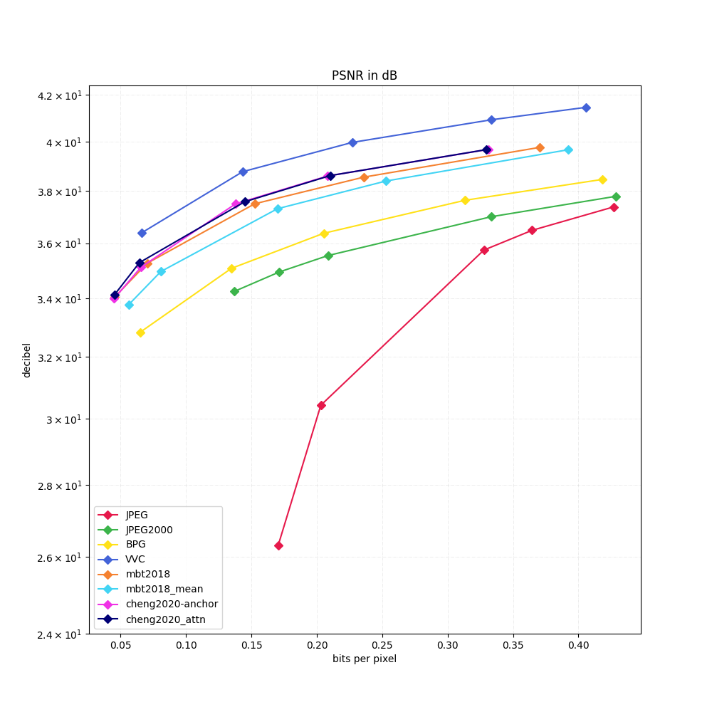
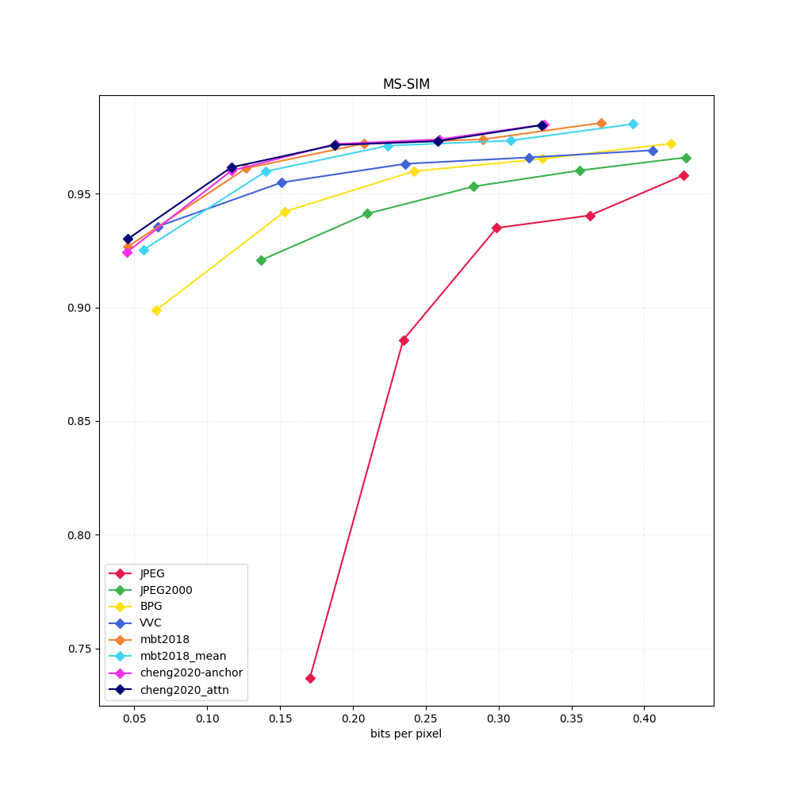
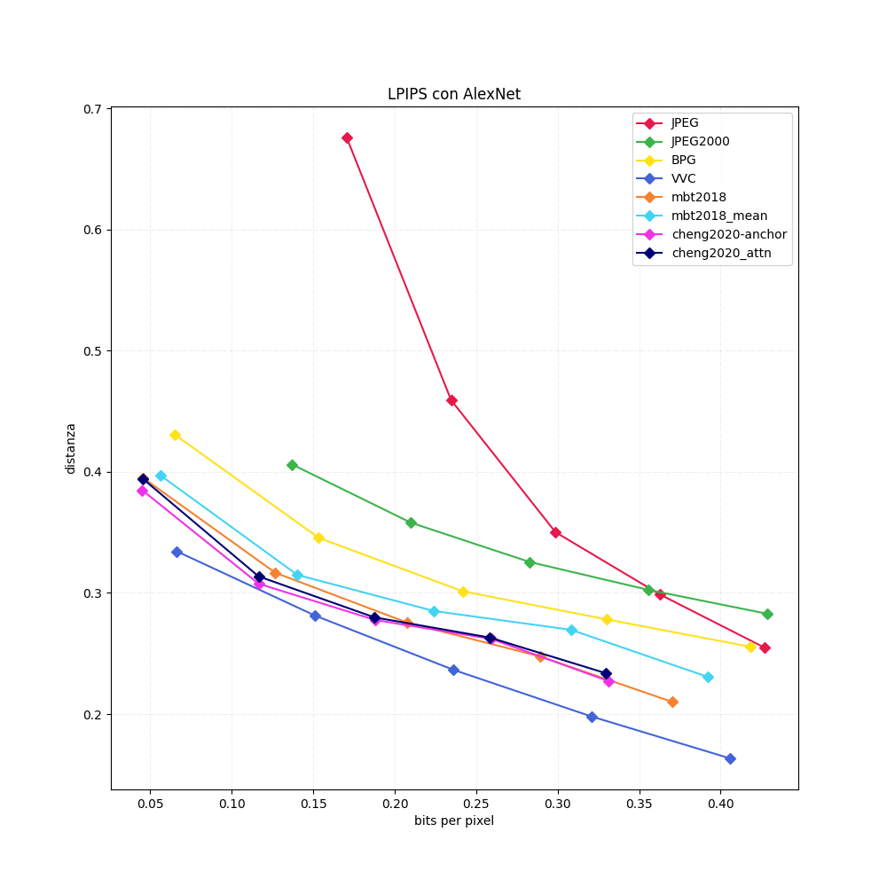
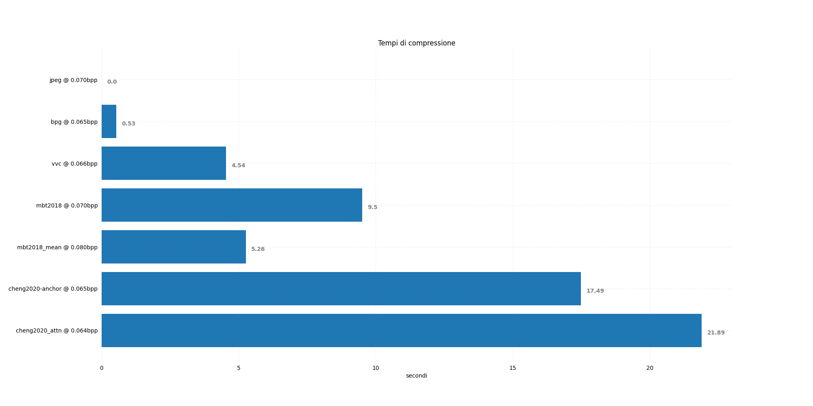
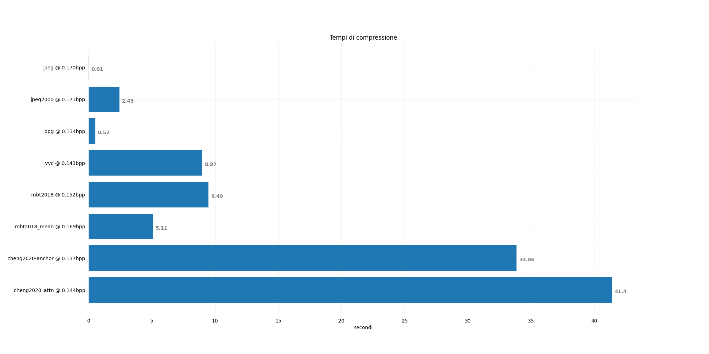
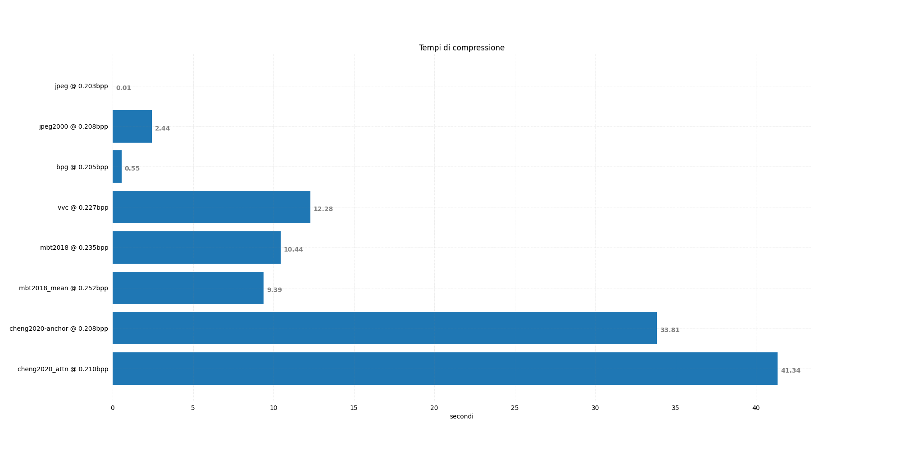
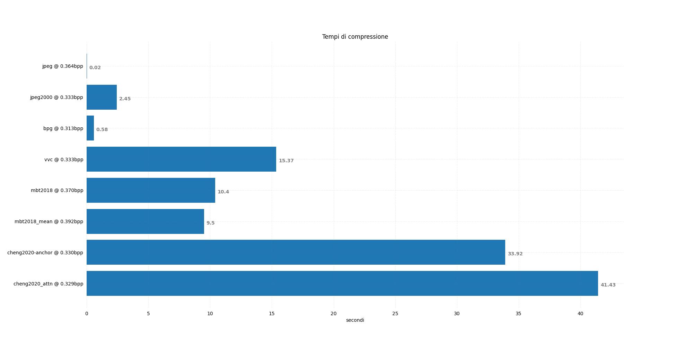

# Compressione di Immagini tramite Autoencoder: Stato dell'Arte e Sviluppi Futuri 🖼️⚡
### *Image Compression via Autoencoders: State of the Art and Future Developments*

[](https://www.python.org/)
[](https://pytorch.org/)
[](https://github.com/InterDigitalInc/CompressAI)
[](https://opensource.org/licenses/MIT)
[-8A0000?style=for-the-badge)](https://www.unipd.it/)

[](https://github.com/ilofX/ImageCompressionAI_Paper)
[](https://github.com/ilofX/imageCompressionAI_Presentation)

---

## 📌 Thesis Metadata & Project Overview

This repository contains the full experimental benchmark and implementation code for the **Bachelor's Degree Thesis in Computer Engineering** (*Laurea in Ingegneria Informatica*) at the **University of Padova** (*Università degli Studi di Padova*, DEI).

- 🎓 **Author / Laureando**: Stella Filippo ([@ilofX](https://github.com/ilofX))
- 👨‍🏫 **Advisor / Relatore**: Prof. Marco Cagnazzo
- 🏛️ **Institution**: Università degli Studi di Padova — Dipartimento di Ingegneria dell'Informazione (DEI)
- 📅 **Academic Year**: 2022–2023 (Graduation Date: **November 16, 2023**)
- 📜 **Thesis Title**: *Compressione di immagini tramite autoencoder, stato dell’arte e sviluppi futuri*

### Abstract
This research presents a comprehensive comparative evaluation between state-of-the-art **Learning-Based / Deep Neural Image Compression architectures** (implemented via PyTorch and the [CompressAI](https://github.com/InterDigitalInc/CompressAI) library) and classical **Standard Image Compression Codecs** (JPEG, JPEG 2000, BPG, and VVC/H.266). All methods were systematically tested on the benchmark **Kodak Lossless True Color Image Suite** across multiple rate-distortion operating points, measuring rate (bpp), objective fidelity (weighted YUV PSNR), structural similarity (MS-SSIM), perceptual quality (LPIPS with AlexNet), and CPU execution speed.

---

## 🔗 Degree Repositories & Resources

- 📄 **Thesis Paper Repository**: [ilofX/ImageCompressionAI_Paper](https://github.com/ilofX/ImageCompressionAI_Paper) — Complete LaTeX source and PDF document (*`main.pdf`*).
- 📊 **Thesis Defense Presentation**: [ilofX/imageCompressionAI_Presentation](https://github.com/ilofX/imageCompressionAI_Presentation) — Presentation deck delivered for the degree defense.

---

## 📐 Lossy Compression Framework & Theoretical Foundations

In accordance with modern image compression theory presented in the thesis, lossy compression pipelines are decomposed into four core functional blocks:

$$\hat{x} = D(Q(\varepsilon(P(x; \theta_\varepsilon))); \theta_D)$$

1. **Spatial Prediction $P(x; \theta_\varepsilon)$**: Exploits spatial redundancies and homogeneous image regions.
2. **Transform / Encoder $\varepsilon$**: Maps the input space $x$ to a sparse latent representation $y$.
3. **Quantization $Q$**: Maps continuous latents into discrete values, introducing controlled information loss.
4. **Entropy Coding & Context Model**: Efficiently encodes quantized symbols into bitstream vectors using arithmetic coding.

```text
[Original Image x] ──> [Spatial Prediction] ──> [Transform ε] ──> [Quantization Q] ──> [Entropy Coding] ──> [Bitstream]
                                                                                                               │
[Reconstructed Image x̂] <── [Spatial Reconstruction] <── [Inverse Transform] <── [Dequantization] <─────────────┘
```

---

## 🧪 Evaluated Codecs & Neural Architectures

### 🏛️ Traditional Codecs
1. **JPEG** *(1992)*: Discrete Cosine Transform (DCT) on $8 \times 8$ blocks with zig-zag scan & run-length encoding (Pillow 10.0.1, Quality parameters: 2, 6, 19, 23, 30).
2. **JPEG 2000** *(2001)*: Discrete Wavelet Transform (DWT) supporting progressive quality decoding (OpenJPEG 2.5.0, Rates: 175, 140, 115, 72, 56).
3. **BPG (Better Portable Graphics)** *(2014, Fabrice Bellard)*: HEVC (H.265) intra-frame coding with variable block sizes (BPG 0.9.8, QP: 49, 44, 41, 38, 36).
4. **VVC (Versatile Video Coding / H.266)** *(2020, JVET)*: State-of-the-art intra-frame video/image compression standard (Fraunhofer HHI VVenC 1.9.1 / VVdeC 2.1.2, QP: 42, 36, 33, 31, 30).

### 🧠 Deep Neural Compression Models (CompressAI Zoo)
1. **`mbt2018_mean`** *(Minnen et al., 2018)*: Variational Autoencoder with a Gaussian mean-only hyperprior (Quality levels 1, 2, 4, 5, 6).
2. **`mbt2018`** *(Minnen et al., 2018)*: Joint Autoregressive and Hierarchical Priors with scale and mean hyperpriors.
3. **`cheng2020_anchor`** *(Cheng et al., 2020)*: Deep Residual Learning with discretized Gaussian Mixture Likelihoods (GMM).
4. **`cheng2020_attn`** *(Cheng et al., 2020)*: Attention-guided Deep Residual Learning with spatial context modeling.
5. **`Wang 2022`** *(Wang et al., 2022)*: Neural Data-Dependent Transform (reviewed theoretically in Thesis Section 2.2.3).

---

## 📊 Evaluation Metrics

1. **Bitrate**: Measured in **Bits Per Pixel (bpp)** over compressed bitstream payload:
   $$\text{bpp}(x) = \frac{\text{Size}_{\text{bits}}(x)}{\text{Width}(x) \times \text{Height}(x)}$$
2. **PSNR (YUV)**: Peak Signal-to-Noise Ratio calculated in YUV color space with component weighting:
   $$\text{MSE}_{\text{weighted}} = \frac{3}{4}\text{MSE}_Y + \frac{1}{8}\text{MSE}_U + \frac{1}{8}\text{MSE}_V$$
   $$\text{PSNR} = 10 \cdot \log_{10}\left(\frac{255^2}{\text{MSE}_{\text{weighted}}}\right)$$
3. **MS-SSIM**: Multi-Scale Structural Similarity Index measuring structural fidelity under Gaussian downsampling scales.
4. **LPIPS (AlexNet)**: Learned Perceptual Image Patch Similarity evaluating deep visual feature distances across AlexNet feature maps.
5. **Execution Speed**: Wall-clock CPU time (seconds) recorded via Python `timeit.default_timer()`.

---

## 📈 Rate-Distortion & Computational Speed Results

### 1. Rate-Distortion Performance Curves

| PSNR (YUV Objective Quality) | MS-SSIM (Structural Quality) | LPIPS AlexNet (Perceptual Distance) |
| :---: | :---: | :---: |
|  |  |  |

> 📌 **Key Finding**: In objective metrics (PSNR), **VVC (H.266)** achieves the highest overall quality, followed by **Cheng 2020** and **Ballé 2018**. In structural metrics (**MS-SSIM**), neural models (**Cheng 2020** & **Ballé 2018**) outperform traditional codecs including VVC.

### 2. Compression Execution Times (CPU Benchmark)

| Execution Time @ ~0.07 bpp | Execution Time @ ~0.16 bpp |
| :---: | :---: |
|  |  |

| Execution Time @ ~0.21 bpp | Execution Time @ ~0.34 bpp |
| :---: | :---: |
|  |  |

---

## 🖥️ Benchmark Environment Specifications

To reflect real-world user scenarios, benchmarks were executed on CPU without dedicated GPU acceleration, allowing process execution alongside ambient OS workloads:

- **Processor (CPU)**: AMD Ryzen 5 5600X (6 Cores / 12 Threads @ 3.7 GHz)
- **RAM**: 16 GB DDR4 @ 3200 MHz
- **Operating System**: Fedora Linux 38 (Kernel 6.5.7-200)
- **Runtime Environment**: Python 3.11.5 / JupyterLab 4.0.7

---

## 🚀 Future Research Directions (Thesis Chapter 4)

1. **SpectralADAM (SADAM)** *(Ballé, 2018)*: Implementing Real Discrete Fourier Transform (RDFT) reparameterization for neural compression training to resolve covariance estimation bottlenecks in standard ADAM optimization.
2. **Slimmable Compressive Autoencoders (SlimCAE)** *(Yang et al., 2021)*: Developing reducible, parameter-flexible neural models to enable efficient AI compression on resource-constrained mobile and edge devices.
3. **Video Compression Extension**: Extending neural autoencoder frameworks to video sequence coding to evaluate deep intra/inter-frame methods against VVC video profiles.

---

## 📁 Repository Structure

```text
ImageCompressionAI/
├── ImagePreparation.ipynb      # Converts Kodak BMP originals to PNG & 10-bit raw YUV for VVC
├── StandardCompression.ipynb   # Batch execution pipeline for JPEG, JPEG2000, BPG, and VVC
├── AICompression.ipynb         # CompressAI PyTorch model inference (mbt2018, cheng2020)
├── Evaluation.ipynb            # Computes YUV PSNR, MS-SSIM, and LPIPS metrics for all outputs
├── GraphCreator.ipynb          # Generates Rate-Distortion curves & speed comparison bar charts
├── IMAGES/                     # Dataset storage (BMP originals, PNGs, and output codec directories)
├── METRICS/                    # Exported plots and performance curves
├── MISC/
│   ├── CompressAI Models Comparison Demo.ipynb  # Interactive visual comparison notebook
│   ├── my_conda_env.yml        # Conda environment file with exact dependencies
│   └── Platform.png            # Experimental platform overview diagram
├── LICENSE                     # MIT License
└── README.md                   # Project documentation
```

---

## 🛠️ Reproduction & Installation Guide

```bash
# Clone the repository
git clone https://github.com/ilofX/ImageCompressionAI.git
cd ImageCompressionAI

# Create Conda environment
conda env create -f MISC/my_conda_env.yml
conda activate imageCompressionAI

# Or install dependencies via pip
pip install torch torchvision compressai pytorch-msssim lpips opencv-python scikit-image matplotlib
```

### Pipeline Execution Order
1. Run [`ImagePreparation.ipynb`](ImagePreparation.ipynb)
2. Run [`StandardCompression.ipynb`](StandardCompression.ipynb)
3. Run [`AICompression.ipynb`](AICompression.ipynb)
4. Run [`Evaluation.ipynb`](Evaluation.ipynb)
5. Run [`GraphCreator.ipynb`](GraphCreator.ipynb)

---

## 📜 License & Acknowledgments

This project is open-source under the [MIT License](LICENSE).

Special thanks to **Prof. Marco Cagnazzo** for thesis supervision and guidance at the **Department of Information Engineering (DEI), University of Padova**.
